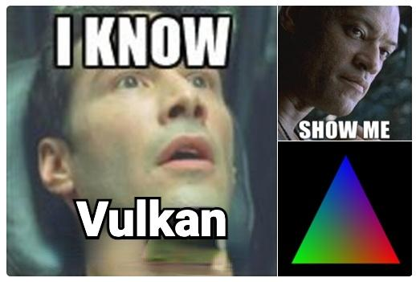

# Learning Vulkan

Learning to use Vulkan API and build my Vulkan Framework

### Environment

- Windows11
- CMake
- vcpkg

### How to use

```sh
cmake preset=default
cmake --build build .
```

### Results up to now

- Drawing a triangle

### Reference

- **[VulkanTutorial](https://github.com/Overv/VulkanTutorial)**
- **[vk_raytracing_tutorial_KHR](https://github.com/nvpro-samples/vk_raytracing_tutorial_KHR)**


