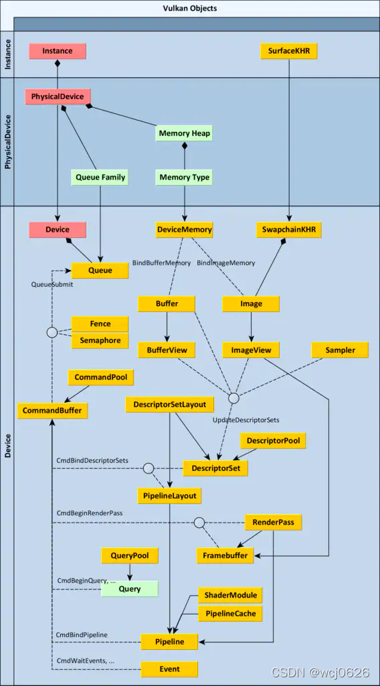
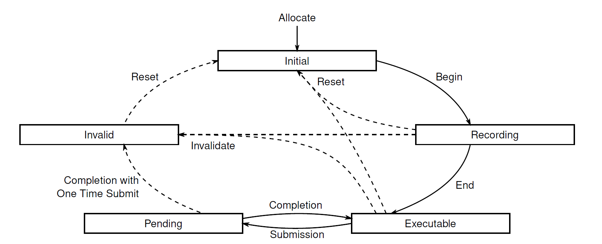

# Overview

1. 创建一个`VkInstance`（实例）和 创建一个表面。
2. 选择一个受支持的显卡（`VkPhysicalDevice`（物理设备））, 为绘制和显示创建一个`VkDevice`（逻辑设备）和`VkQueue`（队列）。
3. 创建交换链，再把交换链里的图像包裹到`VkImageView`（图像视图）里面
   - 表面格式（像素格式，色彩空间）
   - 显示模式（在屏幕上“交换”图像的条件：立即模式，双缓冲，单缓冲）
   - 交换范围（交换链中图像的分辨率）
4. 创建一个渲染过程（`RenderPass`）来指定渲染目标和渲染目标的使用方法
   - 规定附件（颜色附件，深度附件）
   - 规定缓冲中样本数Sample。
   - 规定样本内容如何处理（`loadOp`， `storeOp`）
5. 设置`GraphicsPipeline`图形渲染管线
   - 可编程管线部分 `VkShaderModule`
   - 固定管线功能部分： 顶点输入， 顶点装配（assemble），视口（由`swapchain`控制），光栅化阶段设置，多重采样，深度测试和模板测试，颜色混合，**管线布局**（包含描述符）。
6. 为渲染过程创建帧缓冲
   - 将图像视图（`VkImageView`）附件绑定到帧缓冲中。
   - 设置帧缓冲的长宽（width，height需要根据`swapchain`来设置）。
7. 为交换链中每个可用的图像分配并用绘制命令记录命令缓冲（命令池管理命令缓冲，且需要分配到特定的队列家族中。）
   - 启动RenderPass（这个时候Renderpass需要绑定帧缓冲）。
   - 绑定到图形渲染管线中（graphicsPipeline）
   - 绑定顶点数据，索引数据和描述符集。
   - 设置绘制命令（`vkcmdDrawXXX`）。 结束`renderPass`，结束`CommmadBuffer`
8. 通过获取图像绘制帧，提交正确的那个渲染命令缓存并把图像返回到交换链中
   - 从交换链中请求一个图像`vkAcquireNextImageKHR`。 作为帧缓冲的附件。
   - 提交绘制命令`graphicsQueue`到图形队列。
   - 将图像提交到交换链显示`vkQueuePresentKHR`。

# Queue

Queue通常代表一个GPU线程，GPU执行的就是提交到Queues 中的工作。物理设备中Queue可能不止一个，每一个Queue都被包含在Queue Families中。Queue Families是一个有相同功能的Queue的集合，但是一个物理设备中可以存在多个Queue Families，不同的Queue Families有不同的特性。相同Queue Families中的Queues所有功能都相同并且可以并行运行，但是会有一个优先级的问题，这个需要慎重考虑(优先级较低的Queue可能会等待很长时间都不会处理)。不同的Queue Families主要分为以下几类(通过`VkQueueFlagBits`来分类)：

- VK_QUEUE_GRAPHICS_BIT代表其中的Queue都支持图形操作。
- VK_QUEUE_COMPUTE_BIT指代表其中的Queue都支持计算操作。
- VK_QUEUE_TRANSFER_BIT指代表其中的Queue都支持传输操作。
- VK_QUEUE_TRANSFER_BIT指代表其中的Queue都支持稀疏内存管理操作。

# Command Buffer

- Initial：当创建一个command buffer的时候，它的初始状态就是initial state。一些命令可以将一个command buffer（或一组command buffers）从executable、recording、invalid状态置回该状态。initial 状态的command buffers只能被moved to recording状态，或者释放(Patrick：还可以变成invalid状态吧？)
- Recording：vkBeginCommandBuffer将command buffer的状态从initial 状态切换到 recording状态。一旦command buffer处于recording状态，则可以通过vkCmd*命令来对该command buffer进行录制。
- Executable：vkEndCommandBuffer用于结束一个command buffer的录制，并将其从recording state 切换到 executable state。executable commdn buffers可以被 submitted、reset或者 recorded to another command buffer。
- Pending：Queue submission of a command buffer将command buffer的状态从executable state切换到pending state。当在pending state的时候，应用程序不得以任何方式修改command buffer————因为device可能正在处理command buffer中录制的command。一旦command buffer执行完毕，该状态将会被revert到executable state（如果该command buffer录制的时候打了 VK_COMMAND_BUFFER_USAGE_ONE_TIME_SUBMIT_BIT flag，则会被move to invalid state）。a synchronization command should被用于监测这个事情的发生。
- Invalid：一些操作，比如：修改或者删除command buffer中某个command所使用的资源，都会导致comna的buffer的状态切换到invalid state。invalid state的command buffer只能被reset或者释放。

